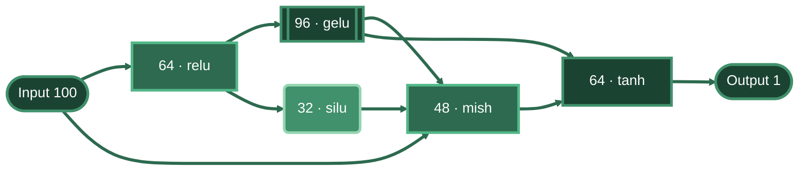
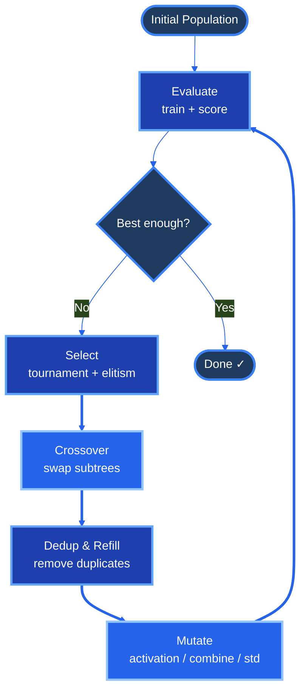

<div align="center">

<!--  -->

# gras
### Neural Architecture Search via Genetic Programming

[](https://crates.io/crates/gras)
[](LICENSE)

**Bring your data, your training loop, your fitness function — gras handles the rest.**

The engine evolves neural network topologies using genetic algorithms.
You provide a `Trainer` (how to train) and a `Fitness` (how to rank),
and gras searches for the best architecture in parallel.

</div>

## Why gras?

Hand-designing networks is slow and misses non-obvious architectures.
gras discovers better structures automatically:


### Before vs After

**Hand-designed** — same width, same activation, straight pipeline:


**gras evolved** — variable dims, diverse activations, rich wiring:



> Each hidden node has its own width, activation, and standardization —
> all discovered by evolution, not hand-tuned.

### How evolution works



## Features

- **Evolutionary NAS** — evolve hidden layer count, dims, activations, combine ops, standardize ops per node
- **Variable hidden dims** — each node draws its own output width with configurable pool and stride
- **Parallel evaluation** — rayon-powered population scoring
- **Deterministic** — one seed reproduces the entire run: population, weights, batches
- **Built-in metrics** — MSE, MAE, RMSE, R2, accuracy, F1, precision, cross-entropy
- **Custom fitness** — drop-in closures for any metric
- **Checkpointing** — engine.json + per-generation snapshots with full topology
- **Deduplication** — removes duplicate topologies via full Spec comparison
- **Elitism** — configurable number of top individuals preserved each generation
- **Selection** — tournament with elitism
- **Crossover** — one-point (matching-node pivot, subtree-like on DAG) or uniform (per-node swap)
- **Mutation** — one random type per individual: activation, combine op, or standardize op
- **16 activations** — Identity, ReLU, GeLU, SiLU, SELU, Tanh, Sigmoid, Mish, LeakyReLU, ELU, GeluTanh, Softplus, HardSwish, HardSigmoid, Sin, Cos
- **4 combine ops** — Add, Mean, Max, Min
- **2 standardize ops** — Identity, LayerNorm
- **Dropout** — configurable per-hidden-node regularization
- **CSV support** — auto-detects CSV and converts to binary on first run
- **Robustness tracking** — tracks topology appearances, fitness stats, identifies most/least reliable architectures

## Installation

```toml
[dependencies]
gras = "0.1"

# Optional CUDA
gras = { version = "0.1", features = ["cuda"] }
```

## Setup

### Requirements

- **Rust** (edition 2024+) — install via [rustup](https://rustup.rs)
- **C compiler** — gcc/clang (needed by the flodl build system)
- **libtorch** — the PyTorch C++ runtime, precompiled for your platform

### CPU

```bash
export LIBTORCH_PATH=/path/to/libtorch
export LD_LIBRARY_PATH=$LIBTORCH_PATH/lib:$LD_LIBRARY_PATH
cargo build
```

### CUDA

1. **NVIDIA driver** — `nvidia-smi` should work
2. **CUDA toolkit** — matching your driver version
3. **libtorch (CUDA variant)** — compiled against the same CUDA version

```bash
export LIBTORCH_PATH=/path/to/libtorch-cuda
export CUDA_HOME=/usr/local/cuda
export LD_LIBRARY_PATH=$LIBTORCH_PATH/lib:$CUDA_HOME/lib64:$LD_LIBRARY_PATH
cargo build --features cuda
```

`auto_device()` returns `Device::CUDA(0)` when compiled with `--features cuda`, `Device::CPU` otherwise.

## What You Bring

gras is flexible — it evolves over **your** training setup:

| You provide | What gras does |
|-------------|----------------|
| **Data** — `.bin` or `.csv` files | Loads, splits, batches |
| **Trainer** — wrap a closure with `trainer::from_fn`, or implement the `Trainer` trait | Trains each network per generation |
| **Fitness** — your ranking metric | Ranks individuals for selection |

The engine handles topology creation, evolution loop, selection, crossover, mutation,
logging, and robustness tracking. You stay in control of training and evaluation.

## Quick Start

```rust
use gras::{Engine, EngineOptions, Fitness, Direction, SelectionMethod, CrossoverMethod, MutationMethod, RobustnessFilter};
use gras::trainer::from_fn;

// 1. Prepare your data: inputs.csv + targets.csv (or .bin)
let data_dir = std::path::Path::new("data/my_problem");

// 2. Define how to rank individuals
let fitness = Fitness::new(
    |pred, target| { /* your metric */ Ok(metric) },
    Direction::Maximize,
    "my_metric",
);

// 3. Define how to train — one closure owns your whole loop
let trainer = from_fn(
    10,    // input_dim
    2,     // output_dim
    gras::auto_device(),
    gras::DType::Float32,
    |net, gen_seed| {
        // load your data, split by gen_seed, train with your loss,
        // score on held-out rows
        Ok((score, Some(loss), param_count))
    },
);

// 4. Configure evolution
let opts = EngineOptions::builder()
    .set_pop_size(50)
    .set_num_generations(10)
    .set_selection(SelectionMethod::Tournament { tournament_size: 2 })
    .set_crossover(CrossoverMethod::OnePoint { action_prob: 0.5 })
    .set_mutation(MutationMethod::Activation { prob: 0.1 })
    .build()
    .unwrap();

// 5. Run
let mut engine = Engine::new(opts, fitness, trainer).unwrap();
engine.run().unwrap();
engine.show_robustness(10, RobustnessFilter::Both);
```

## Custom Training

`from_fn` covers quick custom loops. For stateful or complex trainers — early
stopping, RL, segmentation, anything with its own config — implement the
[`Trainer`] trait directly (see `examples/custom_trainer.rs`). A built-in
`SupervisedTrainer` with a `TrainingConfig` also ships at
`gras::trainer::supervised` (re-exported at `gras::trainer` for short) for
standard SGD/Adam supervised learning; it is a convenience, not the intended
default.

## Options Reference

### Mandatory Fields

| Field | Builder method | Constraint |
|-------|---------------|------------|
| `pop_size` | `.set_pop_size(n)` | ≥ 2 |
| `num_generations` | `.set_num_generations(n)` | ≥ 1 |
| `selection` | `.set_selection(kind)` | Required |
| `crossover` | `.set_crossover(kind)` | Required |
| `mutation` | `.set_mutation(kind)` | Required |

### Defaults

Everything else has conservative defaults. Set only what your experiment needs:

| Option | Default | Builder method |
|--------|---------|---------------|
| `seed` | None (random) | `.set_seed(Some(42))` |
| `num_threads` | 1 | `.set_num_threads(0)` (0 = auto) |
| `dropout_prob` | 0.0 | `.set_dropout_prob(0.1)` |
| `elite_count` | 2 | `.set_elite_count(5)` |
| `dedup_pop_and_fill` | false | `.set_dedup_pop_and_fill(true)` |

#### Topology

| Option | Default | Builder method |
|--------|---------|---------------|
| `hidden_dim_pool` | 8..=64 | `.set_hidden_dim_pool(16..=64)` |
| `hidden_dim_stride` | 8 | `.set_hidden_dim_stride(16)` |
| `min_hidden_num_nodes` | 2 | `.set_min_hidden_num_nodes(5)` |
| `max_hidden_num_nodes` | 8 | `.set_max_hidden_num_nodes(20)` |
| `min_hidden_inputs_per_node` | 1 | `.set_min_hidden_inputs_per_node(5)` |
| `max_hidden_inputs_per_node` | 8 | `.set_max_hidden_inputs_per_node(20)` |
| `min_hidden_outputs_per_node` | 1 | `.set_min_hidden_outputs_per_node(5)` |
| `max_hidden_outputs_per_node` | 8 | `.set_max_hidden_outputs_per_node(20)` |

#### Warm Start

| Option | Default | Builder method |
|--------|---------|---------------|
| `prior_topology_paths` | `[]` (empty) | `.set_prior_topology("some_topology.json")` — add one path |
| | | `.set_prior_topologies(vec!["a.json", "b.json"])` — add multiple |

## Fitness

You bring your own fitness function — it ranks individuals for selection:

```rust
let fitness = Fitness::new(
    |pred, y| my_metric(pred, y),
    Direction::Maximize,
    "my_metric",
);
```

The closure receives `(&Variable, &Variable)` → `Result<f32>`. Direction is `Maximize` or `Minimize`.

## Trainer

You bring your own training loop — it trains and scores each network:

```rust
let trainer = from_fn(
    10,    // input_dim
    2,     // output_dim
    gras::auto_device(),
    gras::DType::Float32,
    |net, gen_seed| {
        // load your data, split by gen_seed, train with your loss,
        // score on held-out rows
        Ok((score, Some(loss), param_count))
    },
);
```

The closure receives `(Network, u64)` → `Result<(f32, Option<f32>, usize)>`: the
network to train and the generation seed (split your data with it to keep runs
reproducible). Return `(score, eval_loss, param_count)` — the engine ranks on
`score`; `eval_loss` and `param_count` are used for logging and robustness.
For stateful or complex trainers, implement the `Trainer` trait instead (see
`examples/custom_trainer.rs`).

## Data Format

### Supported Formats

| Format | Detection | Conversion |
|--------|-----------|------------|
| `.bin` (native) | `inputs.bin` + `targets.bin` exist | None — used directly |
| `.csv` | `inputs.csv` + `targets.csv` exist | Auto-converts to `.bin` in `flodl_data/` on first load, then reads the cache |

### Required Layout

```
data/your_problem/
├── inputs.csv     # [n, input_dim]  — feature tensor (CSV or .bin)
├── targets.csv    # [n, output_dim] — label tensor (CSV or .bin)
└── flodl_data/    # auto-created on first run (cached .bin)
    ├── inputs.bin
    └── targets.bin
```

- `input_dim` and `output_dim` are **provided by your trainer** (they must match the data shapes)
- CSV headers are auto-detected (skipped if non-numeric)
- Lines starting with `#` are treated as comments

### The `.bin` format

`inputs.bin` / `targets.bin` each hold one tensor in a tiny custom binary
format — no external dependency (see `src/utils/data.rs` for the exact
code):

```text
magic "GRA1" (4 bytes) | dtype tag (1 byte) | ndim (u64 LE)
| shape (ndim × u64 LE) | row-major tensor bytes
```

- **dtype tag**: `0` = f32, `1` = f64, `2` = i64 — only these three dtypes
  are storable; anything else is rejected with an error. Datasets are read
  back in whatever dtype was saved (trainers usually cast to f32 on load).
- Header fields are little-endian; the payload is the tensor's raw row-major
  bytes, so the file is exactly `header + numel × element_size` bytes.
- `save_dataset` also writes a small human-readable `meta.json` beside the
  tensors with the input/target shapes (informational only — loading does
  not depend on it).

### How data is loaded

`resolve_dataset(dir)` picks the data source, in priority order:

1. `{dir}/flodl_data/inputs.bin` — the cached `.bin` (created when a `.csv`
   was converted on a previous run)
2. `{dir}/inputs.bin` — direct native `.bin`
3. `{dir}/inputs.csv` — parsed and **auto-converted** to `.bin` in
   `{dir}/flodl_data/`, so the CSV is only parsed once

### Reading & writing data in code

```rust
use gras::data::{resolve_dataset, save_dataset};

// Write a Dataset (inputs [n, in_dim] + targets [n, out_dim]) to a directory:
save_dataset(Path::new("data/my_problem"), &ds).unwrap(); // inputs.bin + targets.bin + meta.json

// Load it back — .bin or .csv, conversion handled for you:
let ds = resolve_dataset(Path::new("data/my_problem")).unwrap(); // Dataset { inputs, targets }
```

- `Dataset` is just `{ inputs: Tensor, targets: Tensor }`.
- `save_tensor(path, &tensor)` / `load_tensor(path)` operate on a single
  tensor file; `save_csv_dataset` / `load_csv_dataset` are the CSV
  counterparts.
- The engine itself only calls `resolve_dataset` — your `Trainer` provides
  `input_dim`/`output_dim`, which must match the loaded shapes.

## Outputs

### Your experience

Running `engine.run()` gives you three layers, from most to least durable:

1. **All data saved automatically** — every run writes `results/<run_id>/`:
   `robustness.csv` with per-topology stats, `engine.json` with the full
   config + whole-run record, and one `gen_XXX.json` snapshot per
   generation. This is the source of truth — everything you see in the
   terminal comes from these files.
2. **Terminal logs (via env var)** — logs are printed through `env_logger`,
   controlled by the `RUST_LOG` environment variable. Default is `info`
   (`RUST_LOG=debug` for per-generation detail, `RUST_LOG=warn` to quiet it).
3. **Tables for convenience** — the run log is three phases: an
   initialization summary, one table per generation, and a done section.
   Post-run analysis is yours: `robustness.csv` holds every row, and
   `engine.show_robustness(...)` (see Quick Start) prints the same data as
   a table in code.

### Run Directory Structure

```
results/<run_id>/
├── engine.json                    # Full run config + whole-run robustness record
├── robustness.csv                 # Every repeated topology, one row each — the analysis artifact
├── improvements/
│   ├── gen_00.json                # All individuals (seed, fitness, loss, params, topology, topo_hash)
│   └── ...
```

The engine writes snapshots only — it does **not** judge topologies for you.
Per-generation files are raw data; which topology is worth inspecting (and
how it truly performed) is answered by `robustness.csv`, which aggregates
appearances of each topology across the whole run. Terminal logs cover three
phases: an initialization summary, one table per generation, and a done
section pointing at `engine.json` and `robustness.csv`.

### Analyzing an individual (.md)

Every topology carries one canonical hash — 16 hex chars (xxh3) — everywhere
it appears: `topo_hash` on each individual in the `gen_XX.json` snapshots and
`topo_id` in `robustness.csv`. To look at a specific topology, copy its hash
from the CSV and render it:

```bash
cargo run --example analyze_from_gen -- results/<run_id> <topo_id>
# or write to a file:  ... results/<run_id> <topo_id> analysis.md
```

The example finds every generation that topology appeared in (reported as
`gen_<NNN> · idx <i>`) and prints the analysis of the latest occurrence:

- a **nodes table** (kind, in/out ports, linear dims, activation, combine, standardize, sources)
- an **edge list** with distance markers
- an ASCII **wiring diagram** — Manhattan-style right-angle arrows, like a circuit schematic
- a **Mermaid flowchart** of the full graph

The same output comes from
`gras::utils::markdown::topology_markdown(&topo, net)` — pass the built
`Network` to enrich the nodes table with linear dims and source wiring.
The Mermaid block renders natively on GitHub, or locally with `mmdc`
(mermaid-cli).

Other runnable examples: `cargo run --example custom_trainer` (implementing
the `Trainer` trait) and `cargo run --example categorical_showcase` (quick
categorical / continuous showcase).

### robustness.csv

One row per repeated topology — this is the complete record of what the run
saw, in plain CSV:

| Column | Meaning |
|--------|---------|
| `topo_id` | canonical topology hash (16 hex chars) — same as `topo_hash` in the snapshots |
| `appearances` | how many times it appeared across generations |
| `fit_mean`, `fit_sd`, `fit_min`, `fit_max` | fitness distribution across appearances |
| `loss_mean`, `loss_sd`, `loss_min`, `loss_max` | loss distribution (present only when trainers report loss) |
| `params` | parameter count |

### Robustness Tracking

In code, `engine.show_robustness(10, RobustnessFilter::Both)` prints the
most-appeared topologies as a table; the CSV above is the same data in
plain text. Repeated topologies look like:

```
── repeated topologies (top 20) ──
  rank   appearances      mean   std_dev      min      max    params  topo_id
  #1             44    0.6103    0.0873   0.4611   0.7855   121610  3a7f2b1c9d4e5f06
```

## Citing gras

If you use gras in your research or project, please mention it:

```bibtex
@software{gras,
  title  = {gras: Neural Architecture Search via Genetic Programming},
  author = {Mauricio Maroto <maulberto3@hotmail.com>},
  url    = {https://crates.io/crates/gras},
  year   = {2026}
}
```

Or simply reference it in your paper or README:

> Topologies were discovered using [gras](https://crates.io/crates/gras),
> a genetic programming framework for neural architecture search.

## Contributing

Contributions are welcome! Please open an issue or PR on [GitHub](https://github.com/maulberto3/gras).

## License

MIT
