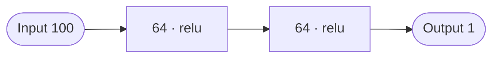
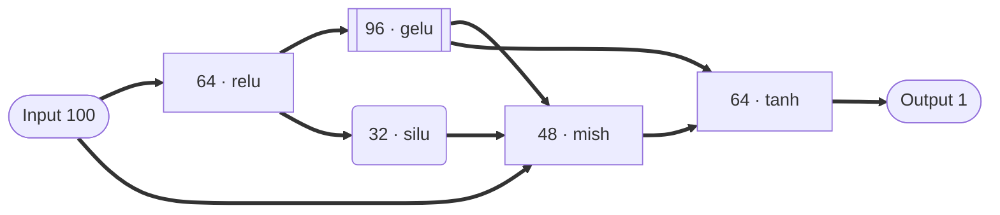
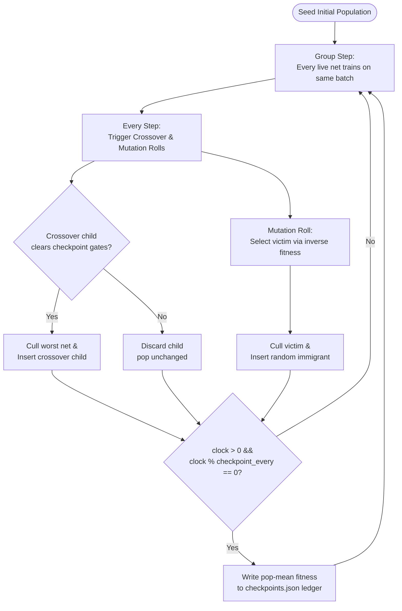

# gras

### Neural Architecture Search via a Continuous Step-Race

`gras` is a lightweight, high-performance Genetic Programming library for Neural Architecture Search in Rust. It evolves neural network topologies under a **step-race**: a unified, continuous evolutionary loop where all networks train and evaluate synchronously on a shared deterministic stream, culling and birthing individuals dynamically.

## Why gras?

Hand-designing network architectures is slow, error-prone, and biased. 
`gras` automates discovery: each hidden node independently evolves its own width, activation function, merge (combine) operation, and normalization structure—all dynamically wired and evaluated in real-time.

### Representation: Hand-designed vs. Evolved

**Hand-designed** — uniform, straight pipeline:



**gras evolved** — diverse widths, heterogeneous activations, complex multi-path routing:



---

### How the Step-Race Loop Works

Evolution is continuous, always active, and gated by a **historical checkpoint ledger**:



---

## Features

- **Continuous Step-Race Engine** — Dynamic culling and insertion on every step instead of rigid generation boundaries.
- **Checkpoint-Gated Crossover** — Crossover children must prove themselves during a history-replay catch-up by clearing a gate of historical population means.
- **Data-Agnostic Trainer Interface** — The evolutionary loop handles selection, culling, and metadata. You own the training recipe (Adam, SGD, schedules, custom losses).
- **100% Deterministic** — Identical `run_seed` and config guarantees identical weight initializations, batches, and evolutionary histories.
- **Bulletproof Resume** — `RaceEngine::resume` reloads active networks, ignores culled tombstones, validates population counts, and replays each net with bit-identical metric parity checked upon revival.
- **16 Activations** — Identity, ReLU, GeLU, SiLU, SELU, Tanh, Sigmoid, Mish, LeakyReLU, ELU, GeluTanh, Softplus, HardSwish, HardSigmoid, Sin, Cos.
- **Combine (Merge) Operators** — Add, Mean, Max, Min (+ Multiply, Subtract, Divide).
- **Standardize Operators** — Identity, LayerNorm.
- **Rich Diagnostic Visualization** — Topology markdown tables, edge lists, ASCII diagrams, and native Mermaid flowchart generation.

---

## Installation

Add this to your `Cargo.toml`:

```toml
[dependencies]
gras = "1.0"

# Compile with CUDA support
gras = { version = "1.0", features = ["cuda"] }
```

### Requirements

- **Rust** (edition 2024+)
- **C/C++ compiler** — gcc/clang (needed by the underlying `flodl` autograd compilation)
- **libtorch** — PyTorch C++ runtime precompiled for your platform

Before compiling or running, initialize the environment:
```bash
# CPU setup
source env_setup.sh
cargo build

# CUDA setup
source env_setup.sh cuda
cargo build $GRAS_FEATURES
```

---

## Quick Start Showcase (`examples/mnist_race.rs`)

We ship a complete, first-class documented showcase example under `examples/mnist_race.rs` illustrating the full capability of the library and config builder.

```bash
# Run the MNIST race showcase on CPU
source env_setup.sh && cargo run --example mnist_race --release

# Run on GPU (if CUDA features are enabled)
source env_setup.sh cuda && cargo run --example mnist_race --release $GRAS_FEATURES

# Custom CLI arguments
source env_setup.sh && cargo run --example mnist_race --release -- --pop 15 --steps 200 --checkpoint-every 10
```

### CLI Options Showcase

The example supports quick CLI configuration parameters:

| Flag | Default | Description |
|------|---------|-------------|
| `--seed N` | random (recorded) | Run seed for 100% reproducible execution |
| `--pop N` | 20 | Population size (active live networks in the race) |
| `--steps N` | 10 | Maximum step budget for the race |
| `--checkpoint-every N` | 10 | Cadence (in steps) of checkpoint gate logs |
| `--log-level L` | "summ" | Verbosity level (`summ`, `minimal`, `full`, `none`) |

---

## Library Quick Start

```rust
use gras::engine::{Direction, Fitness, RaceConfig, RaceEngine, RunMode};
use gras::trainer::TabularTrainer;
use gras::utils::{data, score};

fn main() -> flodl::tensor::Result<()> {
    // 1. Resolve dataset
    let data_dir = std::path::Path::new("data/mnist/train");
    let dataset = data::resolve_dataset(data_dir)?;

    // 2. Define Ranking Fitness (engine culling metric)
    let fitness = Fitness::new(
        score::accuracy_score,
        Direction::Maximize,
        "accuracy",
    );

    // 3. Define Supervised Trainer (Adam, linear gradient clipping)
    let loss_fn = |pred: &gras::Variable, y: &gras::Variable| {
        score::cross_entropy_onehot_loss(pred, y)
    };
    let trainer = TabularTrainer::new(loss_fn)
        .with_learning_rate(1e-3)
        .with_grad_clip(1.0);

    // 4. Configure the Race
    let config = RaceConfig::builder()
        .set_pop_size(10)
        .set_max_steps(100)
        .set_checkpoint_every(10)
        
        // --- Operation Pools (Pristine, Boilerplate-free String slice API!) ---
        .set_combine_ops(&["Mean", "Min", "Max"])
        .set_activations(&["ReLU", "SELU", "GELU"])
        .set_standardize_ops(&["Identity"])
        
        // --- Gating, Mode & Sidecar exports ---
        .set_check(gras::engine::config::CheckMode::Soft) // Checkpoint gate strictness
        .set_mode(RunMode::Tabular)                       // Paradigm mode
        .set_csv_export(true)                             // Writes the metrics.csv long-form trace
        
        // --- Structural Constraints ---
        .set_min_hidden_num_nodes(5)
        .set_max_hidden_num_nodes(10)
        .build();

    // 5. Build and Run the RaceEngine
    let mut engine = RaceEngine::new(gras::engine::RunSpec {
        data_dir: data_dir.to_path_buf(),
        config,
        fitness,
        trainer: Box::new(trainer),
        seed: Some(42),
        run_dir: None,
    })?;

    let stop_reason = engine.run()?;
    println!("Race stopped: {:?}", stop_reason);
    Ok(())
}
```

---

## Detailed Option Surface

### 1. Budgets and Halts
First budget hit cleanly stops the race:

| Option | Default | Builder method | Description |
|--------|---------|----------------|-------------|
| `max_steps` | None | `.set_max_steps(n)` | Total global step budget limit |
| `wall_clock_seconds` | None | `.set_wall_clock_seconds(s)` | Total execution duration limit |
| `max_culls` | None | `.set_max_culls(n)` | Cumulative cull limit |
| `target_score` | None | `.set_target_score(v)` | Stop once best network hits this fitness |

### 2. Genetic Evolution Parameters

| Option | Default | Builder method | Description |
|--------|---------|----------------|-------------|
| `pop_size` | 5 | `.set_pop_size(n)` | Number of active networks in population |
| `checkpoint_every` | 10 | `.set_checkpoint_every(n)` | Step cadence of ledger checkpoints |
| `crossover_rolls` | 1 | `.set_crossover_rolls(n)` | Crossover attempts rolled per step |
| `mutate_rolls` | 1 | `.set_mutate_rolls(n)` | Immigrant rolls processed per step |
| `crossover_prob` | 0.5 | `.set_crossover_prob(v)` | Crossover execution probability |
| `mutate_prob` | 0.2 | `.set_mutate_prob(v)` | Mutation execution probability |
| `crossover_parents` | 2 | `.set_crossover_parents(n)` | Number of parents to combine |
| `crossover_fallback` | false | `.set_crossover_fallback_to_immigrant(b)`| Immigrant fallback if crossover fails |

---

## Data-Agnostic "Bring Your Own Trainer"

The `RaceEngine` acts as an orchestrator. It knows nothing about backpropagation or loss computations. By implementing the `Trainer` trait (`src/trainer/mod.rs`), you can configure custom training schemas entirely from user space:

```rust
pub trait Trainer {
    /// Make the optimizer for a newly built or reloaded network.
    fn make_optimizer(&self, net: &Network) -> Box<dyn flodl::nn::optim::Optimizer>;

    /// Train the network for one clock-step in place.
    fn train_step(
        &mut self,
        net: &mut Network,
        optimizer: &mut dyn flodl::nn::optim::Optimizer,
        step: usize,
        ctx: &StepContext<'_>,
    ) -> flodl::tensor::Result<StepReport>;
}
```

Contract rules enforced at runtime:
1. **Replay Determinism** — Call `seed_step_randomness(ctx.net_seed, step, 0)` in `train_step` to synchronize random dropout masks.
2. **In-place updates** — The engine owns the networks in memory; you borrow, apply gradients, and return.

We ship `TabularTrainer` out of the box as a reference recipe, and `examples/custom_trainer.rs` showcases momentum, linear warmup schedules, and delayed evaluation strategies.

---

## Outputs and Tooling

### Run Directory Layout
Each run creates a dedicated run directory containing:
```
results/<timestamp>/
├── engine.json         # Run identity + the COMPLETE config snapshot (every knob)
├── checkpoints.json    # The evolution gate ledger history
├── metrics.csv         # Long-form per-step trace, one row per (step × net):
│                       #   step, hash, origin, entered_at_step, train_loss,
│                       #   eval_loss, fitness, <informative metrics...>
└── nets/
    ├── <hash>.json         # Live net: topology, net_seed, step, last_metrics, meta
    └── <culled_hash>.json  # Tombstone: is_alive=false, culled_at_step, cull_reason,
                            #   final_smoothed_fitness
```

**Precision.** Every numeric field in these artifacts is the raw `f32` (serde /
`Display` round-trip, i.e. full precision). Only the console log rounds —
per-step metrics to 2 decimals, as `mean ± std`. There is no `options.csv`: run
settings live in `engine.json`, and the per-step history lives in `metrics.csv`,
which covers **every net that ever lived** (culled ones included) — not just the
surviving frontier.

### Solo-Net Recovery Tooling (`examples/train_by_hash.rs`)
Old engines required complex analysis to train an interesting candidate further. In `gras`, simply point our training tool to any run directory and network hash. It will automatically load the blueprint, rebuild the network, replay the batch stream deterministically to restore its weights, and continue training solo:

```bash
cargo run --example train_by_hash [RUN_DIR] [NET_HASH]
```

---

## License

`gras` is licensed under the MIT License.
